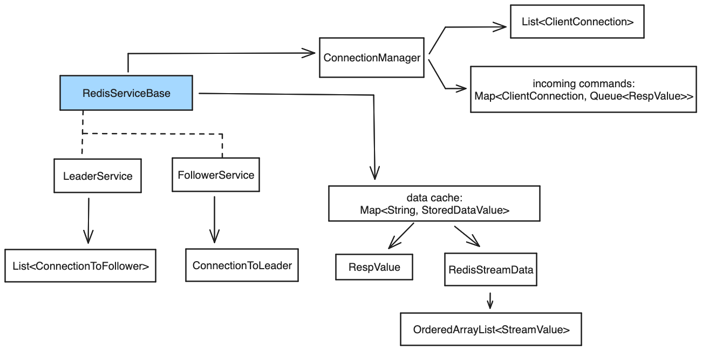

# Java Redis Service

### By Jeffrey Schang

### Java solution to the ["Build Your Own Redis" Challenge](https://codecrafters.io/challenges/redis) from [codecrafters.io](https://app.codecrafters.io)

In this challenge, I have used the [codecrafters.io](https://app.codecrafters.io) platform to build a Redis clone step by step with some of the functionality of Redis. The base challenge includes implementing several basic commands like `PING` , `SET` and `GET` , and expiring keys. Along the way I've crafted (and refactored) the event loop, services, Redis serialization and more.

**Note**: If you want to see more details about the stages and how codecrafters works, check out
[codecrafters.io](https://app.codecrafters.io/courses/redis/overview).

## Stages of Development

### Base stage

The basic steps include setting up a server TCP connection which accepts incoming connections, handles basic commands and responses on those connections. Afterwards, I added support for multiple clients.

For example, in Java the [ServerSocket.accept](https://docs.oracle.com/javase/8/docs/api/java/net/ServerSocket.html#accept--) method blocks while waiting. In [this commit](https://github.com/schangj09/codecrafters-redis/commit/dd7eeb89a771a7497328a17a1ad4caf67ef713fc), I created a separate thread for waiting on new connections and refactored the processing loop into a separate class that can process commands and send responses.

I implemented a class hirearchy to represent the data types of the Resp protocol. And a separate hirearchy to represent the commands of the Redis protocol.

### Extensions - Replication

In the replication extension, I've added support for running the instance as a replication "follower" service. This includes implementing a handshake protocol while starting up the replication service, as well as sending ACK responses from the follower to the leader.

In the final stages of replication, I added the WAIT command, which blocks until getting responses from replication servers. However, the blocking command uncovered an issue in my original design, that required a fair amount of refactoring.

For this stage, I refactored the EventLoop to make a separate thread for reading commands from the input stream and save them into a queue for processing. Then the command loop polls the input queue instead of reading directly from the input stream. These changes were also essential to support blocking reads in the last extension for [Streams](#extensions---streams).

### Extensions - RDB

This extension provides steps to implement reading the input state from a file in the [Redis RDB file format](https://rdb.fnordig.de/file_format.html). This challenge includes parsing the input file and initializing the in-memory data map with stored values and expiration timestamps. I added support for the command line options `--dbfilename` and `--dir` and

I wrote the classes and unit tests for reading encoded binary data from the RDB file format. [`EncodedValue`](src/main/java/org/baylight/redis/rdb/EncodedValue.java) provides the decoding for a number or special format value. [`RdbFileParser`](src/main/java/org/baylight/redis/rdb/RdbFileParser.java) has methods to read the sections of the file.

### Extensions - Streams

This extension adds support for `XADD` , `XRANGE` and `XREAD` with blocking. The primary challenges included blocking on read and supporting multiple streams with auto incrementing ids.

[`StreamsWaitManager`](src/main/java/org/baylight/redis/streams/StreamsWaitManager.java) is a singleton instance class that enables a read command to wait on multiple streams. The reading thread will block on a special lock that is created just for that XREAD command. Then when an item is added to any stream via XADD, then any locks that exist for that stream are notified to unblock the waiting XREAD command.

## Code Structure

The entry point for the Redis implementation is in [`Main`](src/main/java/Main.java).

The program is divided into separation of concerns with a modules for the service itself, handling of connections, classes for parsing options, the serialization protocol and commands. The [`ConnectionManager`](src/main/java/org/baylight/redis/ConnectionManager.java) owns the connections from clients and it owns the thread to process incoming commands. The service classes [`LeaderService`](src/main/java/org/baylight/redis/LeaderService.java) and [`FollowerService`](src/main/java/org/baylight/redis/FollowerService.java) inherit shared functionality in [`RedisServiceBase`](src/main/java/org/baylight/redis/RedisServiceBase.java). These classes own the main processing loop for commands and they provides the methods that implement each of the commands.

Most commands are synchronous commands and execute on the main processor thread, so the service primarly executes commands sequentially on a single thread. However, the command can identify itself as a blocking command, in which case, the processing loop will execute it on a separate thread (allocated through a Java cached thread pool - see [Executors.newCachedThreadPool](https://docs.oracle.com/javase/8/docs/api/java/util/concurrent/Executors.html#newCachedThreadPool-java.util.concurrent.ThreadFactory-)).

For the special case of a replication service, it has a regular ServerSocket for accepting connections, but it also opens a client connection to the leader server. There is a handshake with the leader that is implemented in the [ConnectionToLeader](src/main/java/org/baylight/redis/ConnectionToLeader.java) class, but after that is complete, the ownership of the socket connection to leader is transferred to the [ConnectionManager](src/main/java/org/baylight/redis/ConnectionManager.java) and all future inputs from the leader are treated as incoming commands to the replication server (replicated commands or `PING` or `GETACK` requests from the leader).

There is a [protocol package](src/main/java/org/baylight/redis/protocol) with classes that represent input and output data. All input and output on the stream is represented as a [Redis Serialization Protocol (RESP)](https://redis.io/docs/reference/protocol-spec/) object. Commands are usually represented as a [Resp Array](https://redis.io/docs/reference/protocol-spec/#arrays).

The [commands package](src/main/java/org/baylight/redis/commands) includes a class for each supported command. The [`ArgReader`](src/main/java/org/baylight/redis/commands/ArgReader.java) provides functionality for declaring and validating a set of expected optional and required arguments to command. This enables common validation processing and error messages for invalid command arguments.

There are 2 more packages to support the extensions for databases [rdb](src/main/java/org/baylight/redis/rdb) and [streams](src/main/java/org/baylight/redis/streams).
